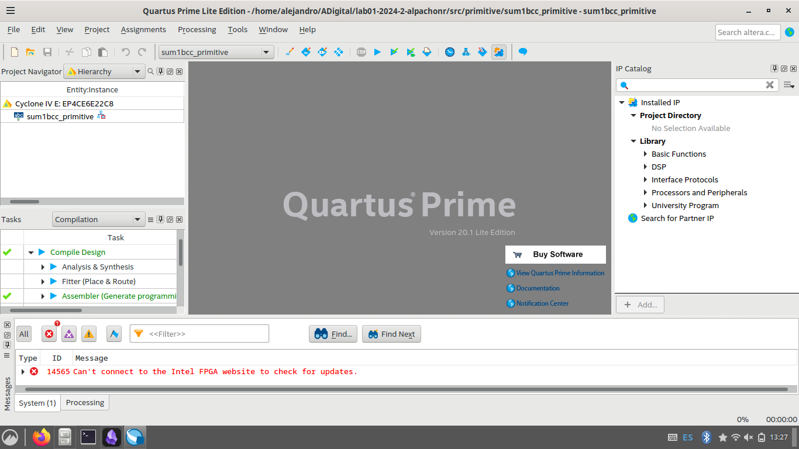
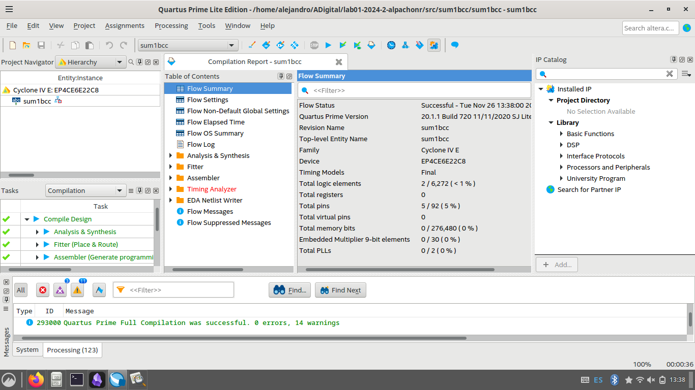
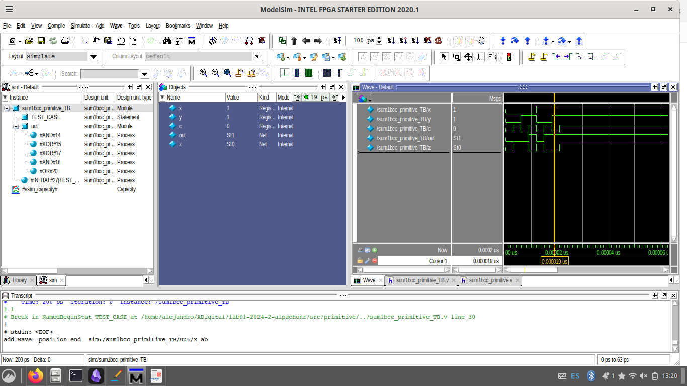
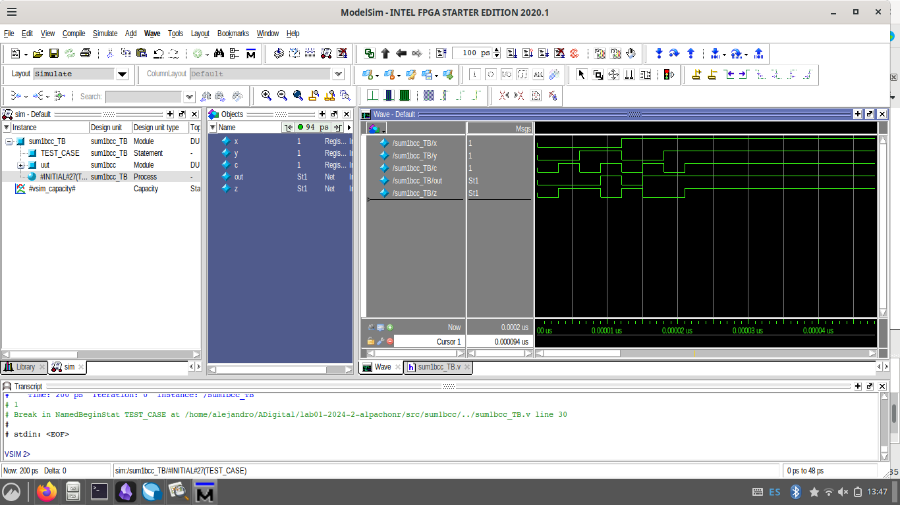

# lab01- sumador 
Laboratorio realizado por:
- Alejandro Pachón Romero / alpachonr@unal.edu.co

## Informe  
Este laboratorio tiene como objetivo aprender a utilizar las herramientas de descripción de hardware, simulación y síntesis de Quartus para empezar a trabajar lógica combinacional usando HDL (Verilog).
### Sumador (primitive)
En la guía se proporciona el código que describe un sumador usando solo compuertas como si fuera hecho con integrados y cables en una protoboard.

A continuación el análisis:
``` verilog
module sum1bcc_primitive (A, B, Ci,Cout,S);

  input  A;
  input  B;
  input  Ci;
  output Cout;
  output S;

  wire a_ab;
  wire x_ab;
  wire cout_t;

  and(a_ab,A,B);
  xor(x_ab,A,B);

  xor(S,x_ab,Ci);
  and(cout_t,x_ab,Ci);

  or (Cout,cout_t,a_ab);

endmodule

```
Primero, notar como se declara el módulo con la palabra reservada "module" y al final de todo se cierra el módulo con "endmodule". Al declarar el módulo se nombra y se le asignan los puertos, la forma en la que están declarados en este código es que primero los nombran todos y posteriormente dentro del módulo, se dice que tipo de puerto es cada uno. 

Podemos ver como hay tres entradas "inputs" las cuales son: A, B y Ci(entrada de acarreo).
Las salidas del módulo "outputs" son Cout(acarreo de salida) y S.

Por la forma en la que están declaradas concuerda con lo visto anteriormente en la guía en el hecho de que son entradas y salidas de 1-bit.

Posteriormente se hacen declaraciones de cables, estos serán usados para conectar las diferentes salidas de las compuertas hasta llegar a los puertos de salida.

Luego se ve como se hace la declaración de cada una de las compuertas donde el primer argumento es la salida de la operación, el segundo y tercer argumento las entradas de la compuerta, entonces se hacen las conexiones de cada compuerta a través de los cables que llevan la señal de al compuerta hasta terminar en las últimas compuertas donde el output respectivo es salida de la compuerta.

### Sumador (HDL)
```Verilog
module sum1bcc (A, B, Ci,Cout,S);

  input  A;
  input  B;
  input  Ci;
  output Cout;
  output S;

  reg [1:0] st;

  assign S = st[0];
  assign Cout = st[1];

  always @ ( * ) begin
    st  <=   A+B+Ci;
  end
  
endmodule
```

Como se vio anteriormente en el módulo primitivo se ve la declaración de modulo, su final, sus puertos y la asignación de tipo a los puertos (entrada o salida). La primera diferencia viene cuando se ve que en vez de la declaración de cables, se declara un vector registro de 2-bit de largo, al cual posteriormente se le asigna la salida S a su bit menos significativo y la salida Cout a su bit más significativo.
Posteriormente se ve un bloque "always" el cual permite hacer operaciones de forma secuencial según cambios en una lista de sensibilidad la cual se da a la derecha del "always" con un "@", dentro de la lista hay un " * " el cual significa que cualquier entrada o registro que cambie, hará que el always ejecute lo que hay dentro. dentro del always hay una operación de suma (con un <= que obliga a ejecutar las operaciones de forma secuencial), y un "end" que cierra el always. Esta versión aunque más compleja técnicamente aprovecha de mejor manera las capacidades que ofrece la FPGA.  

### Entregables 
Acá está el proyecto creado para **sum1bcc_primitive**

Acá está el proyecto creado para **sum1bcc**

Acá está la simulación de **sum1bcc_primitive**

Acá está la simulación de **sum1bcc**

